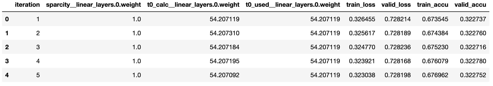

# Lockout
[![PyPI Version][pypi-image]][pypi-url]

Sparsity Inducing Regularization of Fully Connected Neural Networks

## Install

```
pip install lockout [-- upgrade]
```

## Usage
[`PyTorch`](https://pytorch.org/) installation required.  

### **1.** Neural Network Architecture
To modify the architecture of the fully connected neural network change either: 
* The number of input features: n_features
* The number of layers: len(layer_sizes)
* The number of nodes in the i<em>th</em> layer: layer_sizes[i]
```
from lockout.pytorch_utils import FCNN

n_features  = 100       
layer_sizes = [10, 1]   
model_init  = FCNN(n_features, layer_sizes)
```

### **2.** Create DataLoaders
Previous preprocessing and partitioning of the data is assumed.
```
from lockout.pytorch_utils import make_DataLoaders

dl_train, dl_valid, dl_test = make_DataLoaders(xtrain, xvalid, xtest, ytrain, yvalid, ytest)
```

### **3.** Unconstrained Training
Modify the following hyperparameters according to your particular problem:
* lr: Learning rate
* loss_type: Type of loss function
    - loss_type=1 (Mean Squared Error) 
    - loss_type=2 (Mean Cross Entropy)
* optim_id: Optimizer 
    - optim_id = 1: Stochastic Gradient Descend
    - optim_id = 2: Adam
* epochs: Maximum number of epochs during training
* early_stopping: Number of epochs used in the convergence condition
* tol_loss: Maxumum change in the training loss function used in the convergence condition
* reset_weights: Whether or not to reset weights before starts training
```
from lockout import Lockout

lr = 1e-2
loss_type = 1
optim_id  = 1

# Instantiate Lockout
lockout_forward = Lockout(model_init, 
                          lr=lr, 
                          loss_type=loss_type, 
                          optim_id=optim_id)

# Train Neural Network Without Regularization
lockout_forward.train(dl_train, dl_valid, 
                      train_how="unconstrained",
                      epochs=10000,
                      early_stopping=20,
                      tol_loss=1e-6,
                      reset_weights=True)
```

The model at the validation minimum and the unconstrained model can be retrieved and saved for further use.
```
from lockout.pytorch_utils import save_model

# Save Unconstrained Model
model_forward_unconstrained = lockout_forward.model_last
save_model(model_forward_unconstrained, 'model_forward_unconstrained.pth')

# Save Model At Validation Minimum
model_forward_best = lockout_forward.model_best_valid
save_model(model_forward_best, 'model_forward_best.pth')
```

Path data can be retrieved for analysis or graphing. For regression problems, R2 is computed as the accuracy.
```
df = lockout_forward.path_data
df.head()
```
<p align="left">
  
</p>

```
import matplotlib.pyplot as plt
import numpy as np

fig, axes = plt.subplots(figsize=(9,6))
axes.plot(df["iteration"], df["train_loss"], label="Training", linewidth=4)
axes.plot(df["iteration"], df["valid_loss"], label="Validation", linewidth=4)
axes.legend(fontsize=16)
axes.set_xlabel("iteration", fontsize=16)
axes.set_ylabel("Loss Function", fontsize=16)
axes.set_yticks(np.arange(0.3, 1.4, 0.3))
axes.tick_params(axis='both', which='major', labelsize=14)
axes.set_title("Unconstrained", fontsize=16)
axes.grid(True, zorder=2)
plt.show()
```
<p align="left">
  
</p>

### **4.** Lockout Training: Option 1
Within this option, the constraint $t_0$ is iteratively decreased during training. $t_0$ step size is computed as

$
\Delta t_0 =\frac{{t_0}_{\mathrm{final}} - {t_0}_{\mathrm{initial}}}{\mathrm{epochs}}.
$

A small $\Delta t_0$ is necessary to stay on the regularization path. 'epochs' must be chosen accordingly.


## Paper

https://arxiv.org/abs/2107.07160

**Abstract:** Regularized regression and classification procedures attempt to fit a function $f(\bm{x}, \bm{\omega})$ of multiple predictor variables $\bm{x}$, to data $\{\bm{x}_i, \bm{y}_i\}^N_i$, based on some loss criterion $L(y,f)$ but adding a constraint $P(\bm{\omega})\le t_0$ on the joint values of the parameters $\bm{\omega}$ to improve accuracy. While there are efficient methods for finding solutions for all values of $t_0 \ge 0$ with some constraints $P$ in the special case that $f$ is a linear function, none exist for non linear functions such as Neural Networks (NN). Here we present a fast algorithm that provides all such solutions for any differentiable function $f$ and loss $L$, and any constraint $P$ that is an increasing monotone function of the absolute value of each parameter. Applications involving sparsity inducing regularization of arbitrary neural networks are discussed. Empirical results indicate that these sparse solutions are usually superior to their dense counterparts in both accuracy and interpretability. This improvement in accuracy can often make neural networks competitive with, and some times superior to, state of the art methods in the analysis of tabular data.

<p align="left">
  
</p>

<!-- Badges -->

[pypi-image]: https://img.shields.io/pypi/v/lockout
[pypi-url]: https://pypi.org/project/lockout/
